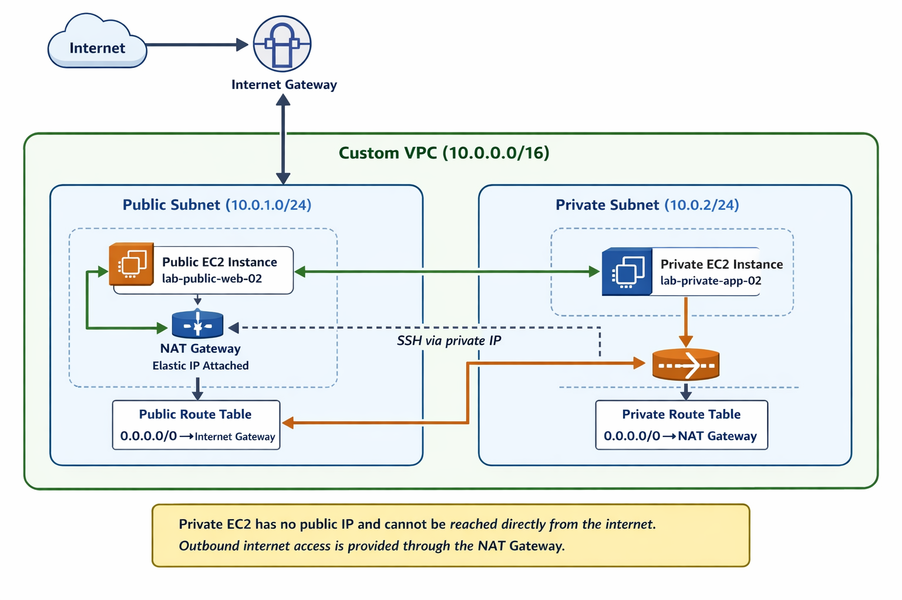

# aws-ec2-vpc-lab-v2

## Project Summary
This lab demonstrates how to build a custom AWS network with both public and private subnets, deploy EC2 instances into each subnet, and configure internet access using an Internet Gateway and NAT Gateway.

The project shows the difference between a publicly reachable EC2 instance and a private EC2 instance that can access the internet outbound but cannot be reached directly from the public internet.

---

## What I Built
- Custom Amazon VPC
- Public subnet
- Private subnet
- Internet Gateway
- NAT Gateway with Elastic IP
- Public and private route tables
- Public EC2 instance
- Private EC2 instance
- Apache web server on the public EC2 instance

---

## Key Skills Demonstrated
- AWS VPC design
- Public vs private subnet configuration
- Route table configuration
- Internet Gateway setup
- NAT Gateway setup
- EC2 deployment
- Security group design
- Linux server access and basic web server setup
- Infrastructure validation and documentation

---

## Validation Performed
- Confirmed the public EC2 instance had a public IP and was reachable in a browser
- Confirmed Apache was installed and running on the public EC2 instance
- Confirmed the private EC2 instance had no public IP
- Confirmed the private EC2 instance was reachable only from inside the VPC
- Confirmed the private EC2 instance had outbound internet access through the NAT Gateway
- Confirmed the private EC2 instance could not be reached directly from the internet

---

## Why This Matters
This project demonstrates foundational AWS networking knowledge by showing how internet-facing and private resources are designed differently inside a VPC. It also shows an understanding of secure architecture patterns by limiting direct exposure of internal resources.

---

## Architecture Diagram

---

## Folder Contents
- `README.md` – project overview
- `architecture-diagram.png` – architecture diagram
- `screenshots/` – lab evidence and validation screenshots
- `notes/build-steps.md` – detailed technical build notes

---

## Outcome
This lab strengthened my hands-on experience with AWS networking, EC2 deployment, and secure subnet design while creating a GitHub-ready cloud portfolio project.
